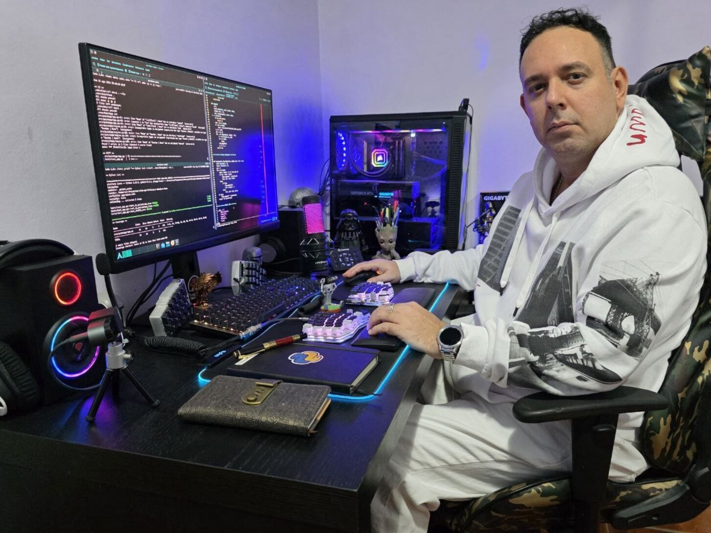

<!-- Profile README for CoderDeltaLAN -->

  

<h1 align="center">Hi, I'm Luis — <code>CoderDeltaLAN</code> 👋</h1>

  
  
  

  

### About me
- 🧰 Python first; also playing with Rust & Node.
- 🧪 I like building CLI tools, automation, and desktop apps on Linux.
- 🖥️ Tiling, terminal, and custom split keyboard enjoyer.

### Tech
`Python` · `FastAPI` · `Flask` · `Pydantic` · `Poetry` · `Docker` · `Linux` · `Bash` · `GitHub Actions`

### Open Source Highlights
- 🧩 *(Add your top repos here with one-line descriptions)*

### Contact
- 🔗 LinkedIn: *(add link)*
- 📨 Email: *(add address)*
- ☕ Support: *(PayPal/Ko-fi link)*

---

> “Code, measure, iterate.”

