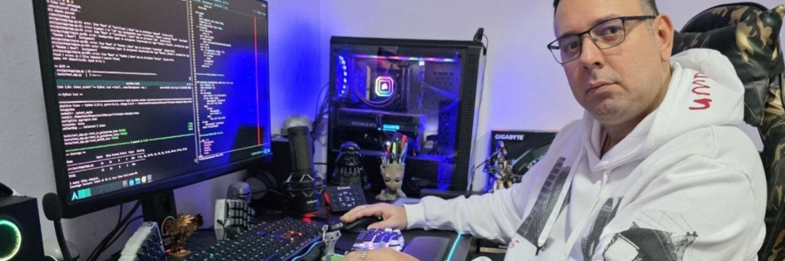

<!-- Encabezado premium -->

  

<!-- Banner fotográfico -->

  

<h1 align="center">Hi, I'm Yosvel — <code>CoderDeltaLAN</code> 👋</h1>

  
  
  

### About me
- 🧰 Python first; also exploring Rust & Node.
- 🧪 Passionate about clean OSS: useful, tested, with CI/CD.
- 🖥️ Tiling, terminal, and custom split keyboard enjoyer.

### Tech
`Python` · `FastAPI` · `Flask` · `Pydantic` · `Poetry` · `Docker` · `Linux` · `Bash` · `GitHub Actions`

### Open Source Highlights
- 🧩 *(Add your top repos here with one-line descriptions)*

### Contact
- ✉️ Email: `coderdeltalan.cargo784@8alias.com`
- ☕ Support: [Donate via PayPal](https://www.paypal.com/donate/?hosted_button_id=YVENCBNCZWVPW)

---

> “Code, measure, iterate.”
