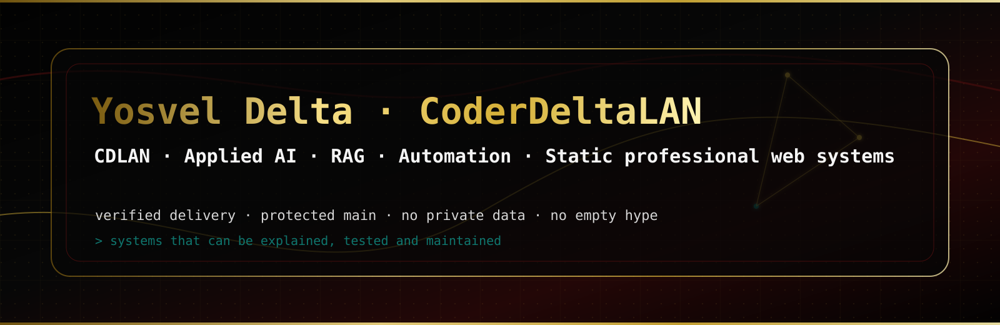
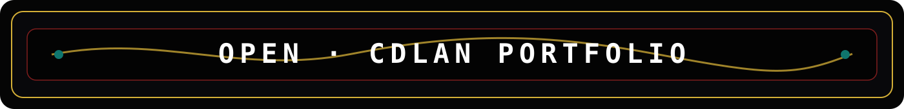
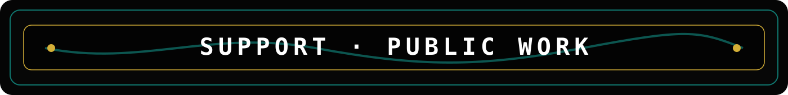
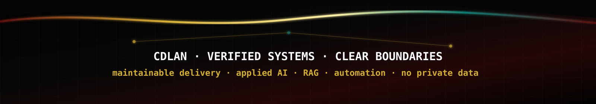

  

  

  
  

  
  
  
  

  <a href="https://coderdeltalan.github.io/cdlan-portfolio/">Portfolio</a>
  ·
  <a href="#system-map">System map</a>
  ·
  <a href="#what-i-build">What I build</a>
  ·
  <a href="#operating-method">Operating method</a>
  ·
  <a href="#public-work">Public work</a>
  ·
  <a href="#security-boundary">Security boundary</a>

---

## System map

<table>
  <tr>
    <td><strong>Identity</strong></td>
    <td>Yosvel Delta · CoderDeltaLAN · CDLAN</td>
  </tr>
  <tr>
    <td><strong>Focus</strong></td>
    <td>Applied AI, RAG, automation, agents, operational documentation and static professional web systems.</td>
  </tr>
  <tr>
    <td><strong>Standard</strong></td>
    <td>Small phases, verified changes, protected main, no private data, no unsupported claims.</td>
  </tr>
  <tr>
    <td><strong>Public front door</strong></td>
    <td><a href="https://coderdeltalan.github.io/cdlan-portfolio/">CDLAN Portfolio</a></td>
  </tr>
</table>

---

## What I build

CDLAN is focused on practical systems with clear limits.

I work around:

- process diagnosis and operational clarity;
- RAG and document intelligence;
- AI agents and assistants with explicit boundaries;
- N8N automation and workflow design;
- static professional websites without unnecessary backend complexity;
- technical documentation and maintainable handover.

I do not present AI as magic. I prefer systems that can be explained, tested, documented and maintained.

---

## Operating method

<pre>
CDLAN system initialized.

> Focus: applied AI · RAG · automation · static web systems
> Method: small phases · pull requests · verification · documented limits
> Boundary: no fake clients · no invented ROI · no hidden private data
> Repository: protected main · required check: verify · workflow_dispatch enabled
> Standard: useful systems · honest claims · maintainable delivery
</pre>

---

## Core stack

  
  
  
  
  

  
  
  
  

---

## Public work

Only current public work that should represent CDLAN is listed here.

| Project | Status | Purpose |
|---|---|---|
| [`cdlan-portfolio`](https://github.com/CoderDeltaLAN/cdlan-portfolio) | Public | Professional CDLAN portfolio and static GitHub Pages site. |
| [`CoderDeltaLAN`](https://github.com/CoderDeltaLAN/CoderDeltaLAN) | Public | GitHub profile README with security and verification baseline. |

Other repositories are not part of the current CDLAN public standard unless they are explicitly listed here.

---

## Security boundary

This profile repository is public presentation only.

It must not contain:

- secrets;
- API keys;
- credentials;
- personal photos;
- private prompts;
- client data;
- private logs;
- backend internals;
- exported automations;
- environment files.

Current repository baseline:

- `SECURITY.md` present;
- `scripts/verify.sh` present;
- GitHub Actions `Verify` workflow present;
- manual `workflow_dispatch` enabled;
- `main` branch protected;
- required status check: `verify`;
- force push blocked;
- branch deletion blocked.

For security-related reports, see [`SECURITY.md`](SECURITY.md).

---

## Contact

For professional contact, use the portfolio:

  

---

## Support

If my public work helps you, you can support it here.

  

  

  Public profile. No personal photos. No private client material. No hidden claims. No magic.

